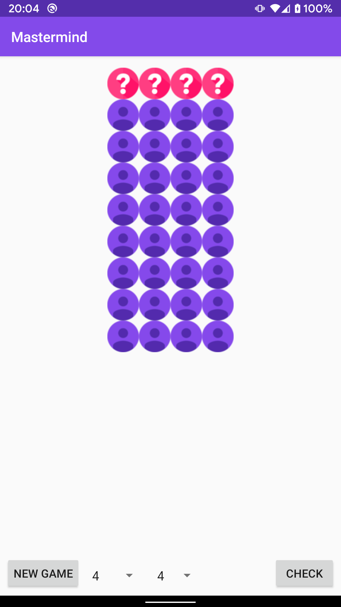
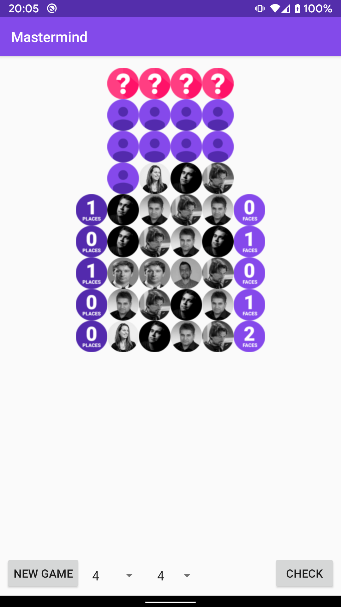
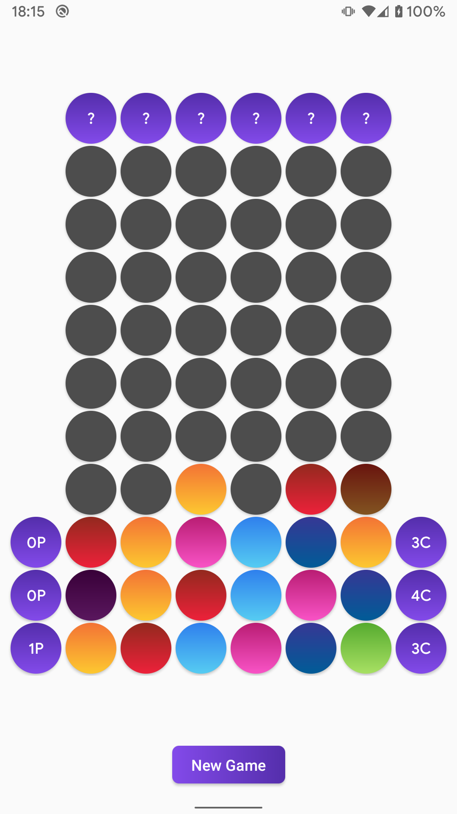
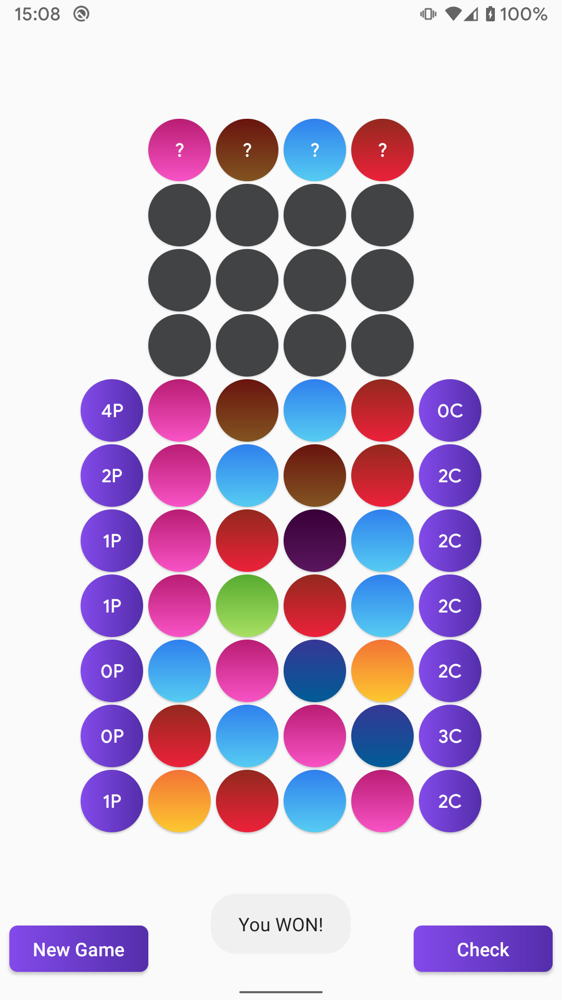
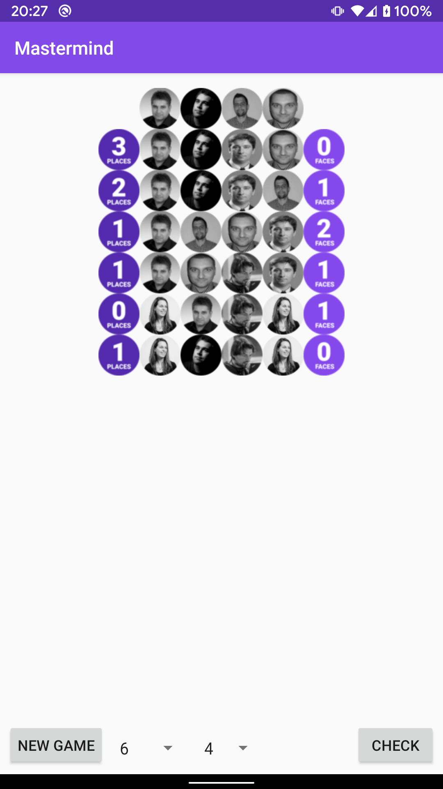

 
 

 

# Mastermind

A quick Android port of my old Java based school project, intended for learning how to publish an app ... mostly.

## Screenshots

## License

This project is licensed under the [GNU General Public License version 3.0](LICENSE.md)

Copyright 2017 [vangyyy](https://github.com/vangyyy)
